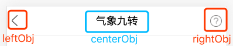

# 头部组件

## 一、示例图



## 二、用法

```js

import { Header } from 'ridingWind-jiniu-base';

<Header
  style={{ color: '#000000' }}
  className={styles.a}
  leftObj={{ clickFunc: () => {} }}
  centerObj={{ title: '气象九转' }}
  rightObj={{ clickFunc: () => {} }}
/>

```

## 三、参数说明

| 参数             | 说明                                          | 类型   | 备注                  |
| ---------------- | --------------------------------------------- | ------ | --------------------- |
| style           | header样式自定义                                  | Object | noRequired            |
| className           | 自定义className                                  | String | noRequired            |
| leftObj     | 左边dom相关设置                                  | Object   | noRequired            |
| centerObj          | 中间dom相关设置                        | Object   |            isRequired           |
| rightObj          | 右边dom相关设置                | Object   |            noRequired           |

### 1、左边dom相关设置（leftObj）

| 参数             | 说明                                          | 类型   | 备注                  |
| ---------------- | --------------------------------------------- | ------ | --------------------- |
| style           | 样式自定义                                  | Object | noRequired            |
| className           | 自定义className                                  | String | noRequired            |
| dom     | dom自定义，eg：`<div>返回</div>`                                  | dom   | noRequired            |
| hide          | 是否隐藏，默认 false                        | Boolean   |            noRequired           |
| clickFunc          | 点击执行的方法                | Function   |            noRequired           |


### 2、中间dom相关设置（centerObj）

`注：此参数的 title 和 dom 有且只能选填一个`

| 参数             | 说明                                          | 类型   | 备注                  |
| ---------------- | --------------------------------------------- | ------ | --------------------- |
| style           | 样式自定义                                  | Object | noRequired            |
| className           | 自定义className                                  | String | noRequired            |
| title     | 显示的文本                                 | String   | noRequired            |
| dom     | dom自定义，eg：`<div>返回</div>`                                  | dom   | noRequired            |
| hide          | 是否隐藏，默认 false                        | Boolean   |            noRequired           |
| clickFunc          | 点击执行的方法                | Function   |            noRequired           |


### 3、右边dom相关设置（rightObj）

| 参数             | 说明                                          | 类型   | 备注                  |
| ---------------- | --------------------------------------------- | ------ | --------------------- |
| style           | 样式自定义                                  | Object | noRequired            |
| className           | 自定义className                                  | String | noRequired            |
| dom     | dom自定义，eg：`<div>返回</div>`                                  | dom   | noRequired            |
| hide          | 是否隐藏，默认 false                        | Boolean   |            noRequired           |
| clickFunc          | 点击执行的方法                | Function   |            noRequired           |
